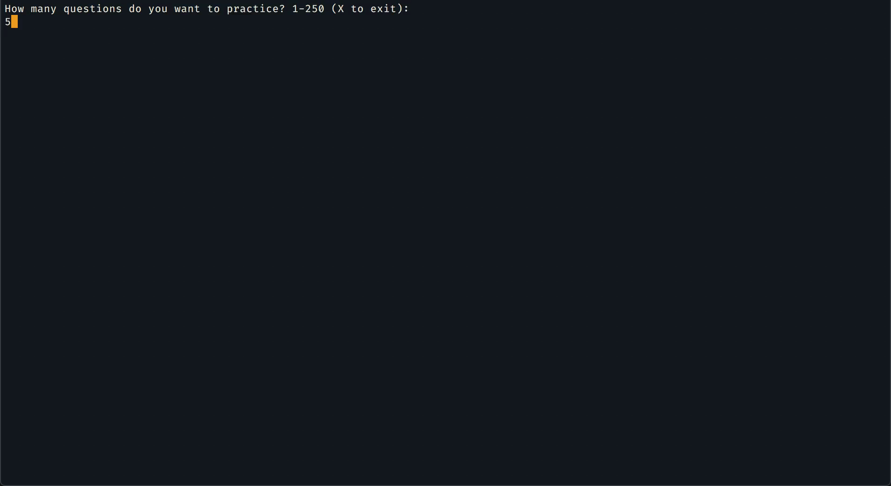

# cissp_test_sim
A mock CISSP exam test simulator using aggregated questions from online sources.

[Source of questions:] (https://drive.google.com/drive/folders/14gNd5oWmghD8hLuPZ7osdE1UQDeSfmu1?usp=sharing)

### Instructions
1. Make sure you have [python](https://www.python.org/) installed. 
2. Clone this repo.
3. Cd into the folder and python3 main.py
4. You can add new questions to the bank, just make sure the questions and answers have the same "key" number in the dictionary.

